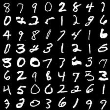
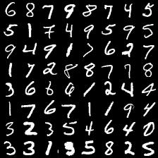
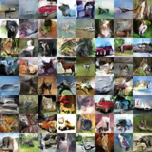
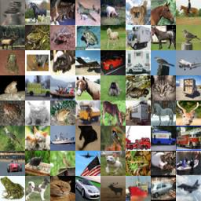
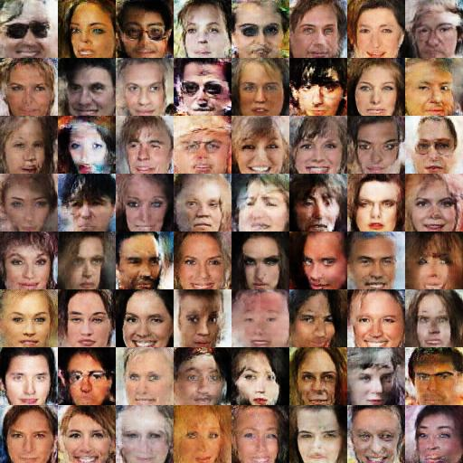
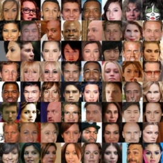

Code for experiments in [Generative Adversarial Autoencoder Networks (GAAN)](https://arxiv.org/abs/1803.08887)

## Setup

### Prerequisites
Python, Numpy, Tensorflow <br>

### Getting Started
We conduct experiments of our model with 1D/2D synthetic data, MNIST, CelebA and CIFAR-10 datasets.

#### 1D demo
In addition to GAAN, other methods, such as GAN, MDGAN, VAEGAN, WGAN-GP are provided in our code.

```
>> cd gaan_toy1d
>> python gan_toy1d.py
```
Quick video demos, you can reproduce easily these videos with our code:

[GAN](https://www.youtube.com/watch?v=eisFNXbGaNI) <br>
[WGANGP](https://www.youtube.com/watch?v=5MDBwdfD5rY) (WGAN-GP can match data distribution at some time, but diverged later) <br>
[VAEGAN](https://www.youtube.com/watch?v=587z8VBcvvQ) <br>
[GAAN](https://www.youtube.com/watch?v=IjbdMNo4m_8)

Our 1D code is based on 1D demo references:

[1] https://github.com/kremerj/gan <br>
[2] http://notebooks.aylien.com/research/gan/gan_simple.html

#### 2D synthetic data
```
>> cd gaan_toy2d
>> python gaan_toy2d.py
```

We provide three different data layouts you can test on: 'SINE' 'PLUS' 'SQUARE'. Just change the parameter `testcase` in the code `gaan_toy2d.py`. For example:
```
testcase      = 'SQUARE'
```

#### Image data (MNIST, CelebA and CIFAR-10)

We provide our code for image datasets, such as: MNIST, CelebA and CIFAR-10.

##### MNIST

```
>> cd gaan_image
>> python gaan_mnist.py
```




Samples generated by our GAAN model (left) and real samples (right).

##### CIFAR-10
Downloading cifar-10 from 'http://www.cs.toronto.edu/~kriz/cifar-10-python.tar.gz' and extracting it into the correct folder: eg. `./data/cifar10/`

```
>> cd gaan_image
>> python gaan_cifar.py
```




Samples generated by our GAAN model (left) and real samples (right).

##### CelebA
Downloading cifar-10 from: https://drive.google.com/drive/folders/0B7EVK8r0v71pTUZsaXdaSnZBZzg and extract into the correct folder: eg. `./data/celeba/`

```
>> cd gaan_image
>> python gaan_celeba.py
```




## Citation
If you use our code in your research, please cite our paper:

```
@article{trung2018gaan,
  title={Generative Adversarial Autoencoder Networks},
  author={Ngoc-Trung Tran and Tuan-Anh Bui and Ngai-Man Cheung},
  journal={arXiv preprint arXiv:1803.08887},
  year={2018}
}
```
