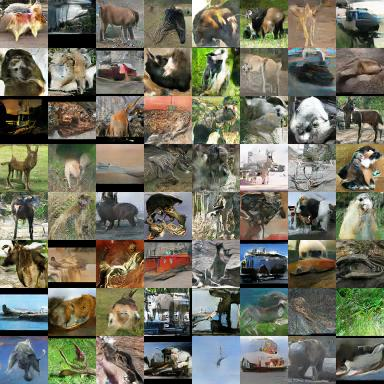
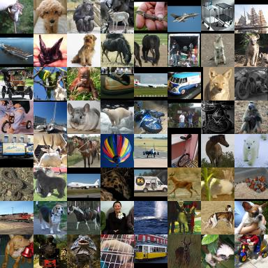

<!---
Code accompanying our paper [Generative Adversarial Autoencoder Networks (GAAN)](https://arxiv.org/abs/1803.08887)
--->

Code accompanying our Dist-GAN paper. To be updated.

## Setup

### Dependencies
Numpy, scikit-learn, Tensorflow <br>

### Getting Started
We conduct experiments of our model with 1D/2D synthetic data, MNIST, CelebA, CIFAR-10 and STL-10 datasets.

#### 1D demo
In addition to GAAN, other methods, such as GAN, MDGAN, VAEGAN, WGAN-GP are provided in our code.

```
>> cd gaan_toy1d
>> python gan_toy1d.py
```

Quick video demos, you can reproduce easily these videos with our code:

[GAN](https://www.youtube.com/watch?v=eisFNXbGaNI) <br>
[WGANGP](https://www.youtube.com/watch?v=5MDBwdfD5rY) (WGAN-GP can match data distribution at some time, but diverged later) <br>
[VAEGAN](https://www.youtube.com/watch?v=587z8VBcvvQ) <br>
[Dist-GAN](https://www.youtube.com/watch?v=IjbdMNo4m_8) <br>

The visualization part of our 1D code is re-used from [here](https://github.com/kremerj/gan):

#### 2D synthetic data
```
>> cd gaan_toy2d
>> python gaan_toy2d.py
```

We provide three different data layouts you can test on: 'SINE' 'PLUS' 'SQUARE'. Just change the parameter `testcase` in the code `gaan_toy2d.py`. For example:
```
testcase      = 'SQUARE'
```

#### Image data (MNIST, CelebA and CIFAR-10)

We provide our code for image datasets, such as: MNIST, CelebA and CIFAR-10.

##### MNIST

```
>> cd gaan_image
>> python gaan_mnist.py
```


From left to right: Samples generated by our GAAN model (DCGAN for MNIST) and real samples.

##### CIFAR-10
Downloading cifar-10 from 'http://www.cs.toronto.edu/~kriz/cifar-10-python.tar.gz' and extracting it into the correct folder: eg. `./data/cifar10/`

```
>> cd gaan_image
>> python gaan_cifar.py
```


From left to right: Samples generated by our GAAN model (DCGAN) and real samples.

##### CelebA
Downloading CelebA from: https://drive.google.com/drive/folders/0B7EVK8r0v71pTUZsaXdaSnZBZzg and extract into the correct folder: eg. `./data/celeba/`

```
>> cd gaan_image
>> python gaan_celeba.py
```


From left to right: Samples generated by our GAAN model (DCGAN) and real samples.

##### STL-10
Downloading STL-10 from: http://ai.stanford.edu/~acoates/stl10/stl10_binary.tar.gz and extract it into a folder. Then, using `./modules/create_stl10.py` to read binary file `unlabeled_X.bin` and save images into a specific folder: eg. `./data/stl-10/`

```
>> cd gaan_image
>> python gaan_stl10.py
```




From left to right: Samples generated by our GAAN model (with standard CNN architecture [2] + hinge loss) and real samples (right).

## Results

FID scores of GAAN for CIFAR-10 and STL-10 datasets are summarized, following experiment setup of [2] with standard CNN architecture (FID is computed with 10K real images and 5K generated images). GAAN is trained with 200K iterations.

| Method              | CIFAR-10      | STL-10|
| -------------       | ------------- | ----- |
| WGAN-GP [1]            | 40.2          | 55.1  |
| SN-GAN  [2]            | 29.3          | 53.1  |
| SN-GAN (hinge loss) [2] | 25.5          | 43.2 (2x updates) |
| GAAN                | 28.23         | -     |
| GAAN (hinge loss)   | **22.95**     | **36.19** (100K) |

*Codes of `hinge loss` and `ResNet` architecture for CIFAR-10 and STL-10 will published soon.*

<!---
## Citation
If you find this work useful in your research, please consider citing:

```
@article{trung2018gaan,
  title={Generative Adversarial Autoencoder Networks},
  author={Ngoc-Trung Tran and Tuan-Anh Bui and Ngai-Man Cheung},
  journal={arXiv preprint arXiv:1803.08887},
  year={2018}
}
```

## Updates
2018/06/18:
- GAAN supports standard CNN architecture of SN-GAN [2].
- New FID results of standard CNN (+ hinge loss) are added.
--->

## References

[1] Ishaan Gulrajani, Faruk Ahmed, Martin Arjovsky, Vincent Dumoulin, Aaron Courville, "Improved Training of Wasserstein GANs", NIPS 2017.<br>
[2] Takeru Miyato, Toshiki Kataoka, Masanori Koyama, Yuichi Yoshida, "Spectral Normalization for Generative Adversarial Networks", ICLR 2018.
